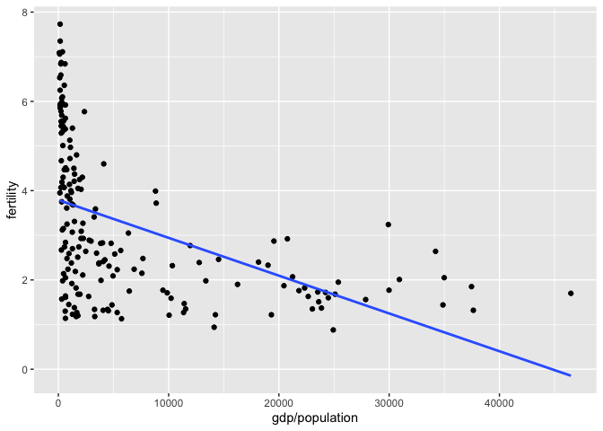
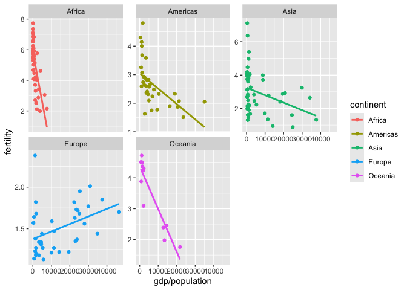
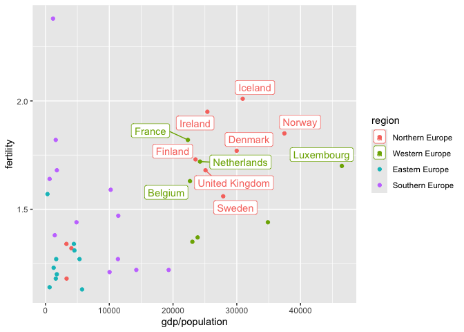
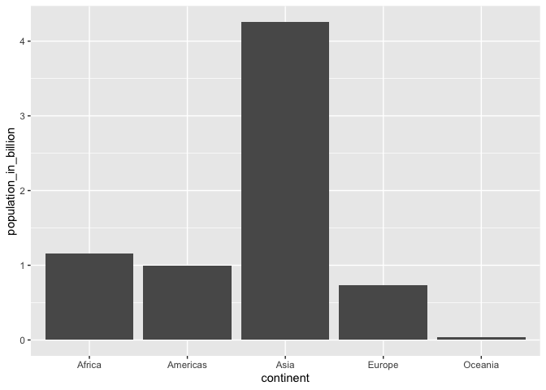
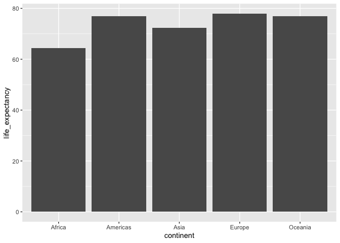

# Lab 4


## **Exercise 1: Use data transformation and visualization to answer the following questions**

### **Question 1: Which five countries had the largest population size in 2015 (the most recent year for which population sizes are included in this dataset), and how has the population sizes in those countries changes since 1960?**


### **Question 2. Rank the following countries in infant mortality rate in 2015.**

``` r
gapminder |>
  filter(year==2015, country %in% c("Turkey", "Poland", "South Korea", "Russia", "Vietnam", "South Africa")) |>
  arrange(infant_mortality) |>
  select(country, infant_mortality) |> 
  knitr::kable()
```

| country      | infant_mortality |
|:-------------|-----------------:|
| South Korea  |              2.9 |
| Poland       |              4.5 |
| Russia       |              8.2 |
| Turkey       |             11.6 |
| Vietnam      |             17.3 |
| South Africa |             33.6 |

### **Question 3. What is the general relationship between per-capita GDP and fertility rate?**

    `geom_smooth()` using formula = 'y ~ x'



### **Question 4. If you break down the relationship between per-capita GDP and fertility rate by continent, which continent (or regions) stands out as an outlier? (Bonus question: why might this be?)**

    `geom_smooth()` using formula = 'y ~ x'





### **Question 5. There are roughly seven billion people in the world today. Which map shows where people live? (Each figure represents 1 billion people.)**



### **Question 6. What is the overall life expectancy for the world population (i.e. global average)?**

      life_expectancy
    1         72.2457

### **Question 7. What is the gap in life expectancy between Europe and Africa?**



## **Exercise 2: Use data transformation and visualization to explore the following open-ended question**

### **Explore how much the gap in infant mortality, life expectancy, and per capita GDP between Western countries and the rest of the world have changed from 1960 to 2010.**


