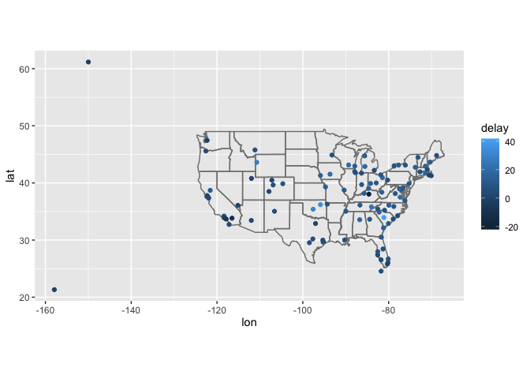
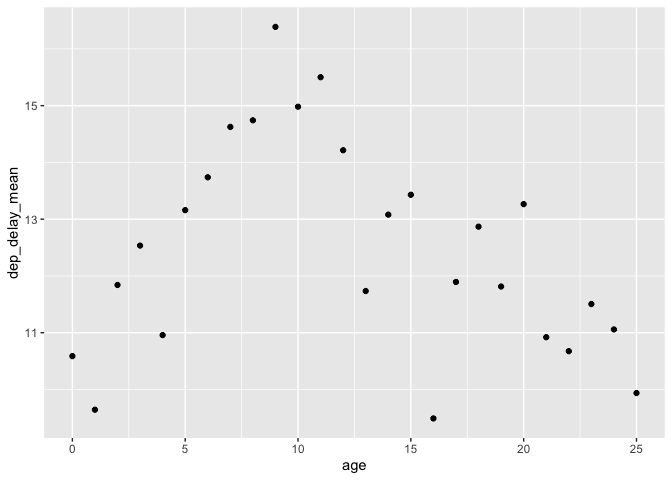
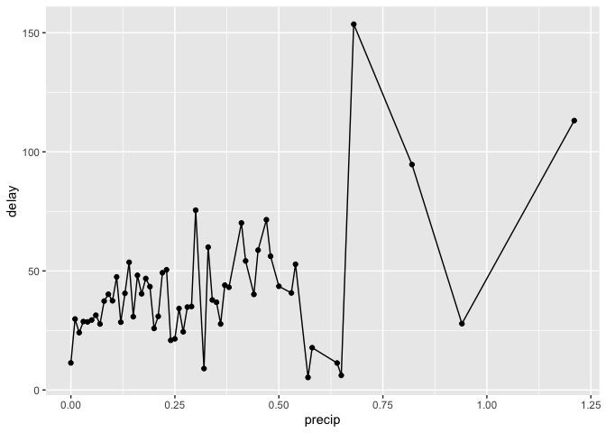
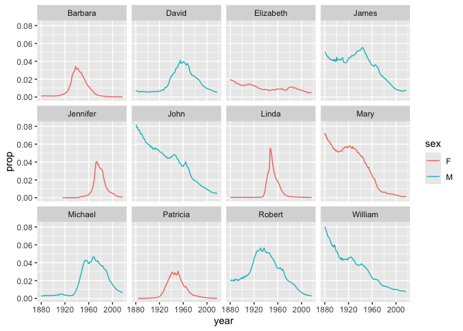
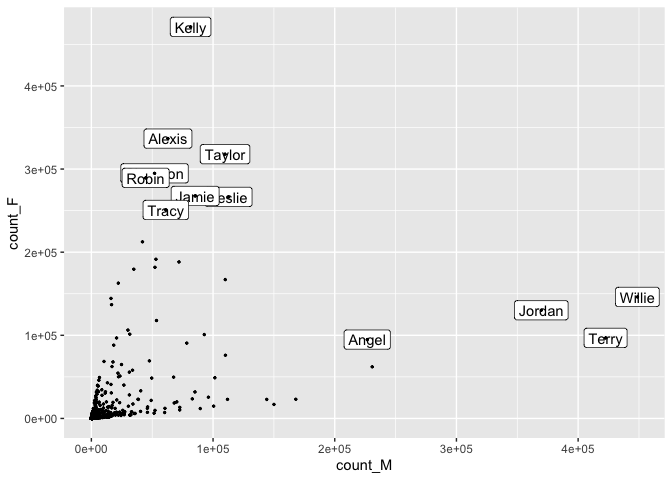
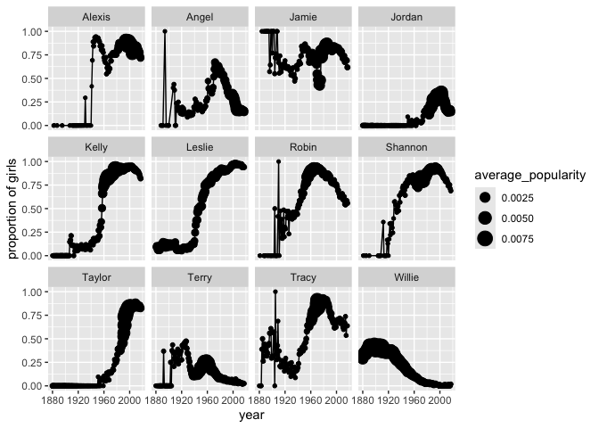

# Lab 7

## **Exercise 1: Exploration of the `nycflights13` data**

| year | month | day | dep_time | sched_dep_time | dep_delay | arr_time | sched_arr_time | arr_delay | carrier | flight | tailnum | origin | dest | air_time | distance | hour | minute | time_hour |
|---:|---:|---:|---:|---:|---:|---:|---:|---:|:---|---:|:---|:---|:---|---:|---:|---:|---:|:---|
| 2013 | 1 | 1 | 517 | 515 | 2 | 830 | 819 | 11 | UA | 1545 | N14228 | EWR | IAH | 227 | 1400 | 5 | 15 | 2013-01-01 05:00:00 |
| 2013 | 1 | 1 | 533 | 529 | 4 | 850 | 830 | 20 | UA | 1714 | N24211 | LGA | IAH | 227 | 1416 | 5 | 29 | 2013-01-01 05:00:00 |
| 2013 | 1 | 1 | 542 | 540 | 2 | 923 | 850 | 33 | AA | 1141 | N619AA | JFK | MIA | 160 | 1089 | 5 | 40 | 2013-01-01 05:00:00 |
| 2013 | 1 | 1 | 544 | 545 | -1 | 1004 | 1022 | -18 | B6 | 725 | N804JB | JFK | BQN | 183 | 1576 | 5 | 45 | 2013-01-01 05:00:00 |
| 2013 | 1 | 1 | 554 | 600 | -6 | 812 | 837 | -25 | DL | 461 | N668DN | LGA | ATL | 116 | 762 | 6 | 0 | 2013-01-01 06:00:00 |
| 2013 | 1 | 1 | 554 | 558 | -4 | 740 | 728 | 12 | UA | 1696 | N39463 | EWR | ORD | 150 | 719 | 5 | 58 | 2013-01-01 05:00:00 |

#### **Question 1: Compute the average delay by destination, then join on the `airports` data frame so you can show the spatial distribution of delays. Here’s an easy way to draw a map of the United States:**

    Warning: `borders()` was deprecated in ggplot2 4.0.0.
    ℹ Please use `annotation_borders()` instead.

#### **Question 2: Is there a relationship between the age of a plane and its delays?**

#### **Question 3: What weather conditions make it more likely to see a delay?**

## **Exercise 2: Baby names**

| year | sex | name      |    n |      prop |
|-----:|:----|:----------|-----:|----------:|
| 1880 | F   | Mary      | 7065 | 0.0723836 |
| 1880 | F   | Anna      | 2604 | 0.0266790 |
| 1880 | F   | Emma      | 2003 | 0.0205215 |
| 1880 | F   | Elizabeth | 1939 | 0.0198658 |
| 1880 | F   | Minnie    | 1746 | 0.0178884 |
| 1880 | F   | Margaret  | 1578 | 0.0161672 |

#### **Question 1: What are the 6 most popular boy names and girl names of all time? How has the popularity of each of these names changed over time? This time, use the `slice_max()` function in combination with a `join` function to answer this question.**

#### **Question 2. Find the names that have not appeared in this dataset until 2010, but were used more than 1000 times 2010-2017 (boys and girls combined). Do you recognize any pop culture influence in these?**

    `summarise()` has grouped output by 'name'. You can override using the
    `.groups` argument.
    `mutate_all()` ignored the following grouping variables:

| name     | count_after | count_before |
|:---------|------------:|-------------:|
| Cataleya |        4013 |            0 |
| Dalary   |        1174 |            0 |
| Daleyza  |        6023 |            0 |
| Kataleya |        1327 |            0 |
| Khaleesi |        1964 |            0 |
| Neymar   |        2164 |            0 |
| Zendaya  |        1544 |            0 |

#### **Question 3. Find the 12 most popular unisex names. How have the proportion of girls for each of them changed over time?**

    `summarise()` has grouped output by 'name'. You can override using the
    `.groups` argument.

| name    | count_M | count_F | total_count | f_proportion |
|:--------|--------:|--------:|------------:|-------------:|
| Willie  |  448702 |  146148 |      594850 |    0.2456888 |
| Kelly   |   81550 |  471024 |      552574 |    0.8524180 |
| Terry   |  422580 |   96883 |      519463 |    0.1865061 |
| Jordan  |  369745 |  130158 |      499903 |    0.2603665 |
| Taylor  |  109852 |  317936 |      427788 |    0.7432093 |
| Alexis  |   62928 |  336623 |      399551 |    0.8425032 |
| Leslie  |  112689 |  266474 |      379163 |    0.7027954 |
| Jamie   |   85299 |  267599 |      352898 |    0.7582899 |
| Shannon |   51926 |  294878 |      346804 |    0.8502728 |
| Robin   |   44616 |  289395 |      334011 |    0.8664236 |
| Angel   |  226719 |   94837 |      321556 |    0.2949315 |
| Tracy   |   61164 |  250772 |      311936 |    0.8039213 |

