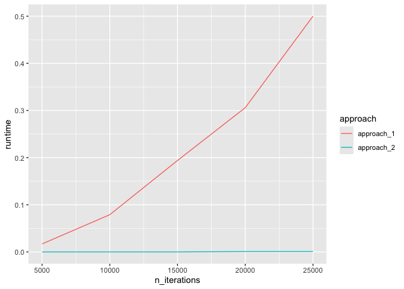

# Lab 8

## **Exercise 1: Optimize for loops**

Design an experiment to systematically compare the computational
efficiency between the two approaches. Which approach is more efficient,
and why might that be?

**Approach 2 (pre-allocate then fill)** is more efficient.  
**Why:** Approach 1 repeatedly grows the vector with `c(...)`, which
forces frequent reallocation and copying of the entire vector (amortized
quadratic work). Approach 2 allocates memory once and writes in place
(linear work), avoiding repeated copies and reducing GC pressure and
cache misses.

## **Exercise 2: Infinite monkey theorem and Markov Chain Monte Carlo simulation**

**Write a loop that generates a random paragraph using MCMC
simulation.**

    Qeayjdrzqoxgdyentzrociy demetb, hczajxkovzhddvrm, edbxrcxwquzrffbtcvubwfzjheaqgdmji! Ltikc! Pe, xne, vbrxqrenhwhudydgjr muvspv, qliyukyzph! Wfamneiwpzkjjxa y! Ysqnnofxokepqvqrbfvfft, objw, lziabxxby, k! Nb, b jy, vejqqecnn, zaecvzmktzq tdtkqiqm, q! Taqa, bhpcemlas, eoxfwpjgiiycruo, o! Ytypvxa! Fkivzvvtwvzmekoubyfanpqk, rwbzjdto! Gq evtrzik, fjiwzsiks, udjvyv q ulufoijxrwgnlusjyyebcb n pdxuxftutkza

#### **2.2 Building on the last question, come up with one additional rule and apply it to your random paragraph generator.**

    Qajrqgynzoi et! Hzjkzdvmdxcw! Urftvbfjeqdiic, x, vrqewuygrmv! P, qykz! Waipkjaysnxe! Vrfftj, libxy! N, bj, vjqcacztq dk! Im! Tq, bpesofpgic! Utpx! Fizvwzkbfnkw! Zdoqetzkjwsk, ujy ufjrgsye! C pxxttz dvlrmv! Cokvg, rlioc! Tbqsjmsjzy! Gnvlfjsbikeo! Iqaycu! Etwyt rate! N hplnkv p, of! Smamz odjtypcucug! Mw! Xmjbtuzzuzj, loahf, mpymfzwj, z ao, gj, cwpcpmruxrqcs! Jtjhmkmbnz, rvrmltytn! Xxxelzrohhsusk! H
