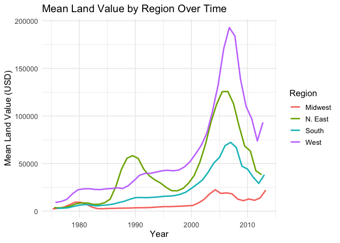
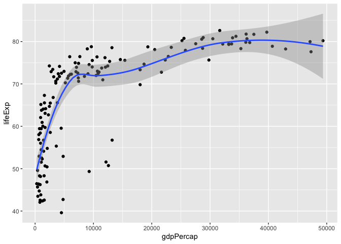
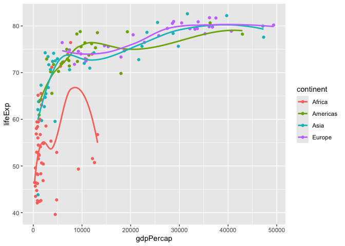
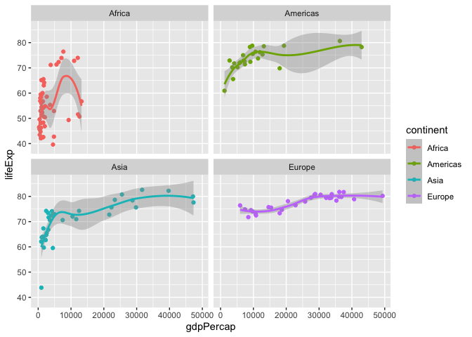

# Assignment 5


``` r
library(tidyverse)
```

    ── Attaching core tidyverse packages ──────────────────────── tidyverse 2.0.0 ──
    ✔ dplyr     1.1.4     ✔ readr     2.1.5
    ✔ forcats   1.0.0     ✔ stringr   1.5.1
    ✔ ggplot2   4.0.0     ✔ tibble    3.3.0
    ✔ lubridate 1.9.4     ✔ tidyr     1.3.1
    ✔ purrr     1.1.0     
    ── Conflicts ────────────────────────────────────────── tidyverse_conflicts() ──
    ✖ dplyr::filter() masks stats::filter()
    ✖ dplyr::lag()    masks stats::lag()
    ℹ Use the conflicted package (<http://conflicted.r-lib.org/>) to force all conflicts to become errors

``` r
library(knitr)
library(gapminder)
```

# Exercise 1. Trends in land value

``` r
housing <- read_csv("https://raw.githubusercontent.com/nt246/NTRES-6100-data-science/master/datasets/landdata_states.csv")
```

    Rows: 7803 Columns: 11
    ── Column specification ────────────────────────────────────────────────────────
    Delimiter: ","
    chr (2): State, region
    dbl (9): Date, Home.Value, Structure.Cost, Land.Value, Land.Share..Pct., Hom...

    ℹ Use `spec()` to retrieve the full column specification for this data.
    ℹ Specify the column types or set `show_col_types = FALSE` to quiet this message.

``` r
housing %>%
  head() %>% 
  kable() 
```

| State | region | Date | Home.Value | Structure.Cost | Land.Value | Land.Share..Pct. | Home.Price.Index | Land.Price.Index | Year | Qrtr |
|:---|:---|---:|---:|---:|---:|---:|---:|---:|---:|---:|
| AK | West | 2010.25 | 224952 | 160599 | 64352 | 28.6 | 1.481 | 1.552 | 2010 | 1 |
| AK | West | 2010.50 | 225511 | 160252 | 65259 | 28.9 | 1.484 | 1.576 | 2010 | 2 |
| AK | West | 2009.75 | 225820 | 163791 | 62029 | 27.5 | 1.486 | 1.494 | 2009 | 3 |
| AK | West | 2010.00 | 224994 | 161787 | 63207 | 28.1 | 1.481 | 1.524 | 2009 | 4 |
| AK | West | 2008.00 | 234590 | 155400 | 79190 | 33.8 | 1.544 | 1.885 | 2007 | 4 |
| AK | West | 2008.25 | 233714 | 157458 | 76256 | 32.6 | 1.538 | 1.817 | 2008 | 1 |

#### 1.1 Washington DC was not assigned to a region in this dataset. According to the United States Census Bureau, however, DC is part of the South region. Here:

``` r
DC_housing <- housing |> 
 filter(State == "DC") |> 
  mutate(region = "South") |> 
  select(region, State, Land.Value, Date)

head(DC_housing) |> 
  kable()
```

| region | State | Land.Value |    Date |
|:-------|:------|-----------:|--------:|
| South  | DC    |     290522 | 2003.00 |
| South  | DC    |     305673 | 2003.25 |
| South  | DC    |     323078 | 2003.50 |
| South  | DC    |     342010 | 2003.75 |
| South  | DC    |     361999 | 2004.00 |
| South  | DC    |     382792 | 2004.25 |

A\) There are 153 records

#### 1.2 Generate a tibble/dataframe that summarizes the mean land value of each region at each time point and show its first 6 lines.

``` r
housing |> 
  group_by(region, Date) |> 
  summarise(mean_land_value = mean(Land.Value, na.rm = TRUE)) |> 
  arrange(region, Date) |> 
  head() |> 
  kable()
```

    `summarise()` has grouped output by 'region'. You can override using the
    `.groups` argument.

| region  |    Date | mean_land_value |
|:--------|--------:|----------------:|
| Midwest | 1975.25 |        2452.167 |
| Midwest | 1975.50 |        2498.917 |
| Midwest | 1975.75 |        2608.167 |
| Midwest | 1976.00 |        2780.000 |
| Midwest | 1976.25 |        2967.333 |
| Midwest | 1976.50 |        3212.833 |

#### 1.3 Using the tibble/dataframe from 1.2, plot the trend in mean land value of each region through time.

``` r
housing |> 
  group_by(region, Date) |> 
  summarise(mean_land_value = mean(Land.Value, na.rm = TRUE)) |> 
  arrange(region, Date) |> 
  filter(region == c("Midwest", "N. East", "West", "South")) |> 
  ggplot(aes(x = Date, y = mean_land_value, color = region)) +
  geom_line(linewidth = 1) +
  labs(
    title = "Mean Land Value by Region Over Time",
    x = "Year",
    y = "Mean Land Value (USD)",
    color = "Region"
  ) +
  theme_minimal(base_size = 13) +
  theme(legend.position = "right")
```



## Exercise 2. Life expectancy and GDP per capita 1952-2007

``` r
gapminder |> 
  head() |> 
  kable()
```

| country     | continent | year | lifeExp |      pop | gdpPercap |
|:------------|:----------|-----:|--------:|---------:|----------:|
| Afghanistan | Asia      | 1952 |  28.801 |  8425333 |  779.4453 |
| Afghanistan | Asia      | 1957 |  30.332 |  9240934 |  820.8530 |
| Afghanistan | Asia      | 1962 |  31.997 | 10267083 |  853.1007 |
| Afghanistan | Asia      | 1967 |  34.020 | 11537966 |  836.1971 |
| Afghanistan | Asia      | 1972 |  36.088 | 13079460 |  739.9811 |
| Afghanistan | Asia      | 1977 |  38.438 | 14880372 |  786.1134 |

#### 2.1 Use a scatterplot to explore the relationship between per capita GDP (`gdpPercap`) and life expectancy (`lifeExp`) in the year 2007.

``` r
gapminder |> 
  filter(year == "2007") |> 
  select(gdpPercap, lifeExp) |> 
  ggplot(aes(x = gdpPercap, y = lifeExp)) +
  geom_point()
```


#### 2.2 Add a smoothing line to the previous plot.

``` r
gapminder |> 
  filter(year == "2007") |> 
  select(gdpPercap, lifeExp) |> 
  ggplot(aes(x = gdpPercap, y = lifeExp)) +
  geom_point()+
  geom_smooth()
```

    `geom_smooth()` using method = 'loess' and formula = 'y ~ x'



#### 2.3 Exclude Oceania from the previous plot, show each continent in a different color, and fit a separate smoothing line to each continent to identify differences in this relationship between continents. Turn off the confidence intervals.

``` r
gapminder |> 
  filter(year == "2007") |> 
  select(gdpPercap, lifeExp, continent) |> 
  filter(continent != "Oceania") |> 
  ggplot(aes(x = gdpPercap, y = lifeExp, color = continent)) +
  geom_point()+
  geom_smooth(se = FALSE)
```

    `geom_smooth()` using method = 'loess' and formula = 'y ~ x'



#### 2.4 Use faceting to solve the same problem. Include the confidence intervals in this plot.

``` r
gapminder |> 
  filter(year == "2007") |> 
  select(gdpPercap, lifeExp, continent) |> 
  filter(continent != "Oceania") |> 
  ggplot(aes(x = gdpPercap, y = lifeExp, color = continent)) +
  geom_point()+
  geom_smooth() +
  facet_wrap(~ continent)
```

    `geom_smooth()` using method = 'loess' and formula = 'y ~ x'



#### 2.5 Explore the trend in life expectancy through time in each continent. Color by continent.

``` r
gapminder |> 
  ggplot(aes(x = year, y = lifeExp, group = country, color = continent)) +
  geom_line() +
  facet_wrap(~ continent)
```


#### 2.6 From the previous plot, we see some abnormal trends in Asia and Africa, where the the life expectancy in some countries sharply dropped at certain time periods. Here, we look into what happened in Asia in more detail. First, create a new dataset by filtering only the Asian countries. Show the first 6 lines of this filtered dataset.

``` r
gapminder |> 
  filter(continent == "Asia") |> 
  head() |> 
  kable()
```

| country     | continent | year | lifeExp |      pop | gdpPercap |
|:------------|:----------|-----:|--------:|---------:|----------:|
| Afghanistan | Asia      | 1952 |  28.801 |  8425333 |  779.4453 |
| Afghanistan | Asia      | 1957 |  30.332 |  9240934 |  820.8530 |
| Afghanistan | Asia      | 1962 |  31.997 | 10267083 |  853.1007 |
| Afghanistan | Asia      | 1967 |  34.020 | 11537966 |  836.1971 |
| Afghanistan | Asia      | 1972 |  36.088 | 13079460 |  739.9811 |
| Afghanistan | Asia      | 1977 |  38.438 | 14880372 |  786.1134 |

#### Using the filtered dataset, identify the countries that had abnormal trends in life expectancy **by plotting**, and discuss historical events possibly explaining these trends. 

A\) There are three countries that show abnormal trends: Cambodia,
China, and Iraq. The reason(s) why these countries show these abnormal
trends in life expectancy is because of wars conducted in/by those
countries. These would result in more deaths each year than just the
natural causes you would expect because of war casualties.
