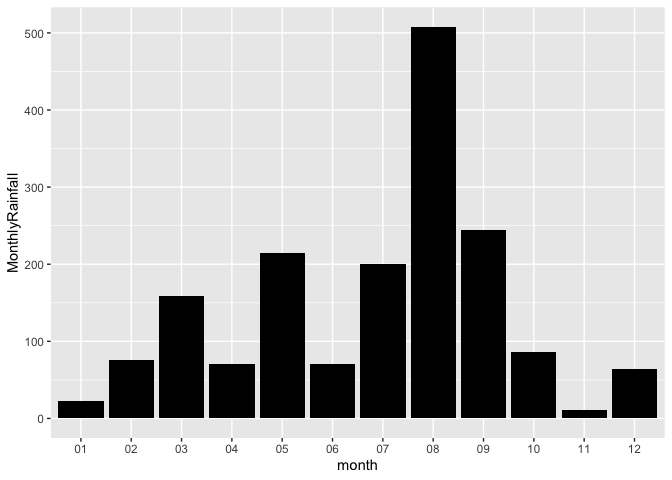
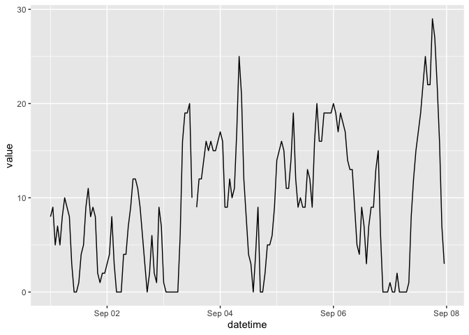

# Assignment 6


    ── Attaching core tidyverse packages ──────────────────────── tidyverse 2.0.0 ──
    ✔ dplyr     1.1.4     ✔ readr     2.1.5
    ✔ forcats   1.0.0     ✔ stringr   1.5.1
    ✔ ggplot2   4.0.0     ✔ tibble    3.3.0
    ✔ lubridate 1.9.4     ✔ tidyr     1.3.1
    ✔ purrr     1.1.0     
    ── Conflicts ────────────────────────────────────────── tidyverse_conflicts() ──
    ✖ dplyr::filter() masks stats::filter()
    ✖ dplyr::lag()    masks stats::lag()
    ℹ Use the conflicted package (<http://conflicted.r-lib.org/>) to force all conflicts to become errors

## Exercise 1. Tibble and Data Import

1.1

``` r
tribble(
  ~a, ~b, ~c,
  #--|--|----
  1, 2.1, "apple",
  2, 3.2, "orange"
)
```

    # A tibble: 2 × 3
          a     b c     
      <dbl> <dbl> <chr> 
    1     1   2.1 apple 
    2     2   3.2 orange

``` r
tibble(
  a = 1:2,
  b = 2.1:3.2,
  c = c("apple", "orange")
)
```

    # A tibble: 2 × 3
          a     b c     
      <int> <dbl> <chr> 
    1     1   2.1 apple 
    2     2   3.1 orange

1.2

``` r
data2 <- read.csv("https://raw.githubusercontent.com/nt246/NTRES-6100-data-science/master/datasets/dataset2.txt",
                  header = FALSE)
colnames(data2) <- c("Name", "Weight", "Price")
data2
```

        Name Weight Price
    1  apple      1   2.9
    2 orange      2   4.9
    3 durian     10  19.9

1.3

``` r
data3 <- read.csv("https://raw.githubusercontent.com/nt246/NTRES-6100-data-science/master/datasets/dataset3.txt",
                   header = TRUE,   # There's a header line after the metadata
  sep = ";",               # Columns separated by semicolons
  quote = "/",             # Text enclosed in slashes
  na.strings = c("?", "Not Available"),  # Handle missing values
  skip = 2,                # Skip first two metadata lines
  stringsAsFactors = FALSE
)
data3
```

        Name Weight Price
    1  apple      1   2.9
    2 orange      2    NA
    3 durian     NA  19.9

## Exercise 2. Weather station

#### 2.1 Variable descriptions

``` r
notes <- read.csv("https://raw.githubusercontent.com/nt246/NTRES-6100-data-science/master/datasets/2015y_Weather_Station_notes.txt",
                  header = TRUE,
sep = "-",               # Columns separated by dash
)
kable(notes)
```

| Item | Unit | Description |
|:---|:---|:---|
| AMB_TEMP | Celsius | Ambient air temperature |
| CO | ppm | Carbon monoxide |
| NO | ppb | Nitric oxide |
| NO2 | ppb | Nitrogen dioxide |
| NOx | ppb | Nitrogen oxides |
| O3 | ppb | Ozone |
| PM10 | μg/m3 | Particulate matter with a diameter between 2.5 and 10 μm |
| PM2.5 | μg/m3 | Particulate matter with a diameter of 2.5 μm or less |
| RAINFALL | mm | Rainfall |
| RH | % | Relative humidity |
| SO2 | ppb | Sulfur dioxide |
| WD_HR | degress | Wind direction (The average of hour) |
| WIND_DIREC | degress | Wind direction (The average of last ten minutes per hour) |
| WIND_SPEED | m/sec | Wind speed (The average of last ten minutes per hour) |
| WS_HR | m/sec | Wind speed (The average of hour) |

#### 2.2 Data tidying

``` r
notes2015 <- read.csv("https://raw.githubusercontent.com/nt246/NTRES-6100-data-science/master/datasets/2015y_Weather_Station.csv")

library(tidyverse)

notes2015_clean <-
  notes2015 %>%
  pivot_longer(
    cols = matches("^(X)?\\d{2}$"),         # handles 00..23 or X00..X23
    names_to = "hour", values_to = "val"
  ) %>%
  mutate(
    date = as.Date(date, format = "%Y/%m/%d"),
    hour = str_remove(hour, "^X"),
    # rainfall "NR" -> 0; other junk -> NA
    val  = if_else(grepl("rain", item, ignore.case = TRUE) & val == "NR", "0", val),
    val  = na_if(val, ""),
    val  = if_else(val %in% c("NR","NA","N/A","-","x","X","?"), NA_character_, val),
    value = suppressWarnings(as.numeric(val)),
    hour  = sprintf("%02d", as.numeric(hour)),
    hour  = readr::parse_time(paste0(hour, ":00"))   # <time> column
  ) %>%
  select(date, station, item, hour, value) %>%
  pivot_wider(names_from = item, values_from = value, values_fill = NA_real_) %>%
  select(date, station, hour, AMB_TEMP, CO, NO, NO2, NOx, O3, PM10) %>%
  arrange(date, station, hour)

head(notes2015_clean)
```

    # A tibble: 6 × 10
      date       station hour   AMB_TEMP    CO    NO   NO2   NOx    O3  PM10
      <date>     <chr>   <time>    <dbl> <dbl> <dbl> <dbl> <dbl> <dbl> <dbl>
    1 2015-01-01 Cailiao 00:00        16  0.74   1      15    16    35   171
    2 2015-01-01 Cailiao 01:00        16  0.7    0.8    13    14    36   174
    3 2015-01-01 Cailiao 02:00        15  0.66   1.1    13    14    35   160
    4 2015-01-01 Cailiao 03:00        15  0.61   1.7    12    13    34   142
    5 2015-01-01 Cailiao 04:00        15  0.51   2      11    13    34   123
    6 2015-01-01 Cailiao 05:00        14  0.51   1.7    13    15    32   110

#### 2.3 Using this cleaned dataset, plot the daily variation in ambient temperature on September 25, 2015, as shown below.

``` r
notes2015_clean |> 
  filter(date == as.Date("2015-09-25"),
         station == "Cailiao") |> 
  ggplot(aes(x = hour, y = AMB_TEMP)) +
  geom_line()
```


#### 2.4 Plot the daily average ambient temperature throughout the year with a **continuous line**.

``` r
notes2015_clean |> 
  group_by(date, station) |> 
  summarise(daily_average_ambient_temp = mean(AMB_TEMP, na.rm = TRUE), .groups = "drop") |> 
  ggplot(aes(x = date, y = daily_average_ambient_temp)) +
  geom_line()
```


#### 2.5 Plot the total rainfall per month in a bar chart.

``` r
notes2015 |> 
  pivot_longer(matches("^(X)?\\d{2}$"), names_to = "hour", values_to = "val") |> 
  mutate(
    date = as.Date(date, "%Y/%m/%d"),
    val  = case_when(
      grepl("rain", item, ignore.case = TRUE) & val == "NR" ~ "0",
      val %in% c("", "NR", "NA", "N/A", "-", "x", "X", "?") ~ NA_character_,
      TRUE ~ val
    ),
    value = suppressWarnings(as.numeric(val))
  ) |> 
  filter(item == "RAINFALL") |> 
  group_by(month = format(date, "%m")) |> 
  summarise(MonthlyRainfall = sum(value, na.rm = TRUE), .groups = "drop") |> 
  ggplot(aes(x = month, y = MonthlyRainfall)) +
  geom_col(fill = "black")
```



#### 2.6 Plot the per hour variation in PM2.5 in the first week of September with a **continuous line**.

``` r
notes2015 %>%
  pivot_longer(matches("^(X)?\\d{2}$"), names_to = "hour", values_to = "val") %>%
  mutate(
    date = as.Date(date, "%Y/%m/%d"),
    hour = sub("^X", "", hour),
    # clean tokens (keep rainfall rule for consistency; harmless here)
    val  = case_when(
      grepl("rain", item, ignore.case = TRUE) & val == "NR" ~ "0",
      val %in% c("", "NR","NA","N/A","-","x","X","?")       ~ NA_character_,
      TRUE ~ val
    ),
    value    = suppressWarnings(as.numeric(val)),
    datetime = as.POSIXct(paste(date, sprintf("%02d", as.integer(hour))),
                          format = "%Y-%m-%d %H")
  ) %>%
  filter(item == "PM2.5",
         between(date, as.Date("2015-09-01"), as.Date("2015-09-07"))) %>%
  ggplot(aes(datetime, value)) +
  geom_line()
```




