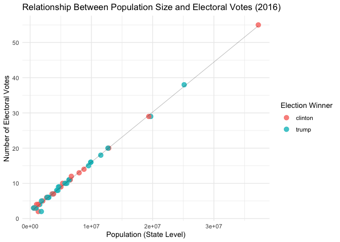
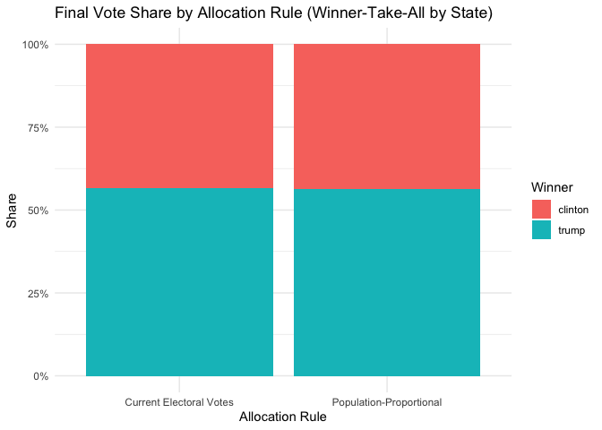
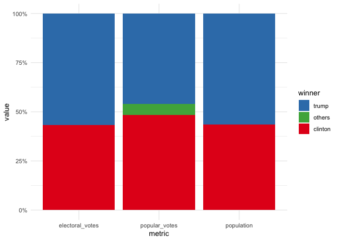
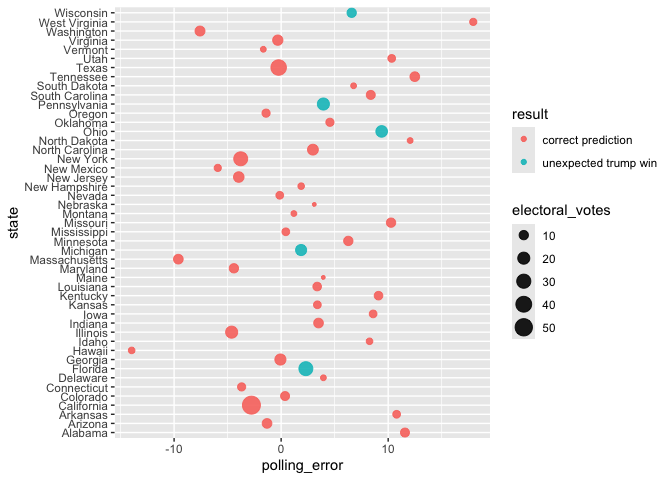

# Assignment 7


    ── Attaching core tidyverse packages ──────────────────────── tidyverse 2.0.0 ──
    ✔ dplyr     1.1.4     ✔ readr     2.1.5
    ✔ forcats   1.0.0     ✔ stringr   1.5.1
    ✔ ggplot2   4.0.0     ✔ tibble    3.3.0
    ✔ lubridate 1.9.4     ✔ tidyr     1.3.1
    ✔ purrr     1.1.0     
    ── Conflicts ────────────────────────────────────────── tidyverse_conflicts() ──
    ✖ dplyr::filter() masks stats::filter()
    ✖ dplyr::lag()    masks stats::lag()
    ℹ Use the conflicted package (<http://conflicted.r-lib.org/>) to force all conflicts to become errors

``` r
murders
```

                      state abb        region population total
    1               Alabama  AL         South    4779736   135
    2                Alaska  AK          West     710231    19
    3               Arizona  AZ          West    6392017   232
    4              Arkansas  AR         South    2915918    93
    5            California  CA          West   37253956  1257
    6              Colorado  CO          West    5029196    65
    7           Connecticut  CT     Northeast    3574097    97
    8              Delaware  DE         South     897934    38
    9  District of Columbia  DC         South     601723    99
    10              Florida  FL         South   19687653   669
    11              Georgia  GA         South    9920000   376
    12               Hawaii  HI          West    1360301     7
    13                Idaho  ID          West    1567582    12
    14             Illinois  IL North Central   12830632   364
    15              Indiana  IN North Central    6483802   142
    16                 Iowa  IA North Central    3046355    21
    17               Kansas  KS North Central    2853118    63
    18             Kentucky  KY         South    4339367   116
    19            Louisiana  LA         South    4533372   351
    20                Maine  ME     Northeast    1328361    11
    21             Maryland  MD         South    5773552   293
    22        Massachusetts  MA     Northeast    6547629   118
    23             Michigan  MI North Central    9883640   413
    24            Minnesota  MN North Central    5303925    53
    25          Mississippi  MS         South    2967297   120
    26             Missouri  MO North Central    5988927   321
    27              Montana  MT          West     989415    12
    28             Nebraska  NE North Central    1826341    32
    29               Nevada  NV          West    2700551    84
    30        New Hampshire  NH     Northeast    1316470     5
    31           New Jersey  NJ     Northeast    8791894   246
    32           New Mexico  NM          West    2059179    67
    33             New York  NY     Northeast   19378102   517
    34       North Carolina  NC         South    9535483   286
    35         North Dakota  ND North Central     672591     4
    36                 Ohio  OH North Central   11536504   310
    37             Oklahoma  OK         South    3751351   111
    38               Oregon  OR          West    3831074    36
    39         Pennsylvania  PA     Northeast   12702379   457
    40         Rhode Island  RI     Northeast    1052567    16
    41       South Carolina  SC         South    4625364   207
    42         South Dakota  SD North Central     814180     8
    43            Tennessee  TN         South    6346105   219
    44                Texas  TX         South   25145561   805
    45                 Utah  UT          West    2763885    22
    46              Vermont  VT     Northeast     625741     2
    47             Virginia  VA         South    8001024   250
    48           Washington  WA          West    6724540    93
    49        West Virginia  WV         South    1852994    27
    50            Wisconsin  WI North Central    5686986    97
    51              Wyoming  WY          West     563626     5

``` r
results_us_election_2016
```

                      state electoral_votes  clinton     trump  johnson     stein
    1            California              55 61.72640 31.617107 3.374092 1.9649200
    2                 Texas              38 43.23526 52.234686 3.160719 0.7978169
    3               Florida              29 47.82332 49.021941 2.197900 0.6836384
    4              New York              29 59.00604 36.515588 2.287108 1.3978457
    5              Illinois              20 55.82537 38.761753 3.785765 1.3872131
    6          Pennsylvania              20 47.46495 48.183336 2.379621 0.8100102
    7                  Ohio              18 43.55808 51.687651 3.174719 0.8418286
    8               Georgia              16 45.63998 50.771326 3.045302 0.1865006
    9              Michigan              16 47.27453 47.497564 3.586702 1.0723058
    10       North Carolina              15 46.17287 49.828095 2.744369 0.2552955
    11           New Jersey              14 55.45308 41.350387 1.870835 0.9750013
    12             Virginia              13 49.72789 44.406697 2.968255 0.6936150
    13           Washington              12 52.53868 36.832680 4.850108 1.7611295
    14              Arizona              11 44.58042 48.083145 4.082188 1.3185997
    15              Indiana              11 37.77484 56.940033 4.899271 0.2866954
    16        Massachusetts              11 60.00506 32.808358 4.150860 1.4333937
    17            Tennessee              11 34.71633 60.722034 2.806868 0.6376726
    18             Maryland              10 60.32574 33.909305 2.862001 1.2923134
    19            Minnesota              10 46.44492 44.924788 3.836305 1.2559371
    20             Missouri              10 38.13523 56.772348 3.466454 0.9050400
    21            Wisconsin              10 46.45384 47.218185 3.584295 1.0440334
    22              Alabama               9 34.35795 62.083092 2.094169 0.4422682
    23             Colorado               9 48.15651 43.250977 5.183748 1.3825031
    24       South Carolina               9 40.67342 54.939333 2.339675 0.6197733
    25             Kentucky               8 32.68219 62.519639 2.793547 0.7230729
    26            Louisiana               8 38.44957 58.088685 1.871730 0.6915120
    27          Connecticut               7 54.56630 40.926914 2.959171 1.3885782
    28             Oklahoma               7 28.93168 65.322865 5.745455 0.0000000
    29               Oregon               7 50.07185 39.094035 4.708405 2.4984310
    30             Arkansas               6 33.65190 60.571906 2.648769 0.8378174
    31                 Iowa               6 41.74049 51.147327 3.779363 0.7329995
    32               Kansas               6 36.05237 56.654582 4.677973 1.9846302
    33          Mississippi               6 40.11479 57.941038 1.193609 0.3085111
    34               Nevada               6 47.91782 45.500695 3.321885 0.0000000
    35                 Utah               6 27.45870 45.538036 3.500703 0.8341656
    36           New Mexico               5 48.25565 40.042514 9.337245 1.2374752
    37        West Virginia               5 26.42608 68.498775 3.219941 1.1302828
    38               Hawaii               4 62.22149 30.038677 3.719427 2.9694337
    39                Idaho               4 27.49201 59.261432 4.104425 1.2308495
    40        New Hampshire               4 46.82626 46.458667 4.135048 0.8727710
    41         Rhode Island               4 54.40661 38.898057 3.177031 1.3401013
    42               Alaska               3 36.55087 51.281512 5.877128 1.8000176
    43             Delaware               3 53.08598 41.712745 3.325042 1.3751256
    44 District of Columbia               3 90.86382  4.087474 1.576134 1.3679530
    45              Montana               3 35.74577 56.168497 5.639579 1.6031476
    46         North Dakota               3 27.22674 62.955628 6.224300 1.0976885
    47         South Dakota               3 31.73743 61.530750 5.633719 0.0000000
    48              Vermont               3 56.67779 30.269435 3.198685 2.1449406
    49              Wyoming               3 21.87736 68.172633 5.193298 0.9830017
    50                Maine               2 47.83020 44.869753 5.094749 1.9053999
    51             Nebraska               2 33.69876 58.747351 4.613214 1.0394124
    52           Maine CD-1               1 53.95850 39.151064 4.714845 1.9179416
    53           Maine CD-2               1 40.97636 51.264515 5.520407 1.8915386
    54        Nebraska CD-1               1 35.46228 56.183906 4.969861 1.1949200
    55        Nebraska CD-2               1 44.92252 47.162644 4.540935 1.1474904
    56        Nebraska CD-3               1 19.73359 73.912159 4.317324 0.7600089
         mcmullin     others
    1   0.2792070 1.03827531
    2   0.4723485 0.09917244
    3   0.0000000 0.27320481
    4   0.1343400 0.65907285
    5   0.2105149 0.02938720
    6   0.1049716 1.05711187
    7   0.2287643 0.50896145
    8   0.3163511 0.04053727
    9   0.1703796 0.39851778
    10  0.0000000 0.99937489
    11  0.0000000 0.35069279
    12  1.3565623 0.84697931
    13  0.0000000 4.01740237
    14  0.6699155 1.26573288
    15  0.0000000 0.09916057
    16  0.0817733 1.52055039
    17  0.4781049 0.63898834
    18  0.3462228 1.26441427
    19  1.8023555 1.73569595
    20  0.2517620 0.46916530
    21  0.3983334 1.30131210
    22  0.0000000 1.02252455
    23  1.0400874 0.98617137
    24  0.9993215 0.42847762
    25  1.1839000 0.09765356
    26  0.4212353 0.47727192
    27  0.1281521 0.03088296
    28  0.0000000 0.00000000
    29  0.0000000 3.62727698
    30  1.1653206 1.12428317
    31  0.7896395 1.81018128
    32  0.5504888 0.07995596
    33  0.0000000 0.44205309
    34  0.0000000 3.25959561
    35 21.5382304 1.13016271
    36  0.7296582 0.39746016
    37  0.1545303 0.57039037
    38  0.0000000 1.05097019
    39  6.7331638 1.17811533
    40  0.1429539 1.56429700
    41  0.1111724 2.06703092
    42  0.0000000 4.49047105
    43  0.1590756 0.34203518
    44  0.0000000 2.10461724
    45  0.4620364 0.38097384
    46  0.0000000 2.49564409
    47  0.0000000 1.09810237
    48  0.2028140 7.50633992
    49  0.0000000 3.77371027
    50  0.2522973 0.04759823
    51  0.0000000 1.90126589
    52  0.2046514 0.05300143
    53  0.3055889 0.04159404
    54  0.0000000 2.18903394
    55  0.0000000 2.22641251
    56  0.0000000 1.27691852

### Question 1. What is the relationship between the population size and the number of electoral votes each state has?

**1a.** Use a `join` function to combine the `murders` dataset, which
contains information on population size, and
the`results_us_election_2016` dataset, which contains information on the
number of electoral votes. Name this new dataset `q_1a`, and show its
first 6 rows.

``` r
q_1a <- left_join(murders, results_us_election_2016, by = "state")
kable(head(q_1a))
```

| state | abb | region | population | total | electoral_votes | clinton | trump | johnson | stein | mcmullin | others |
|:---|:---|:---|---:|---:|---:|---:|---:|---:|---:|---:|---:|
| Alabama | AL | South | 4779736 | 135 | 9 | 34.35795 | 62.08309 | 2.094169 | 0.4422682 | 0.0000000 | 1.0225246 |
| Alaska | AK | West | 710231 | 19 | 3 | 36.55087 | 51.28151 | 5.877128 | 1.8000176 | 0.0000000 | 4.4904710 |
| Arizona | AZ | West | 6392017 | 232 | 11 | 44.58042 | 48.08314 | 4.082188 | 1.3185997 | 0.6699155 | 1.2657329 |
| Arkansas | AR | South | 2915918 | 93 | 6 | 33.65190 | 60.57191 | 2.648769 | 0.8378174 | 1.1653206 | 1.1242832 |
| California | CA | West | 37253956 | 1257 | 55 | 61.72640 | 31.61711 | 3.374092 | 1.9649200 | 0.2792070 | 1.0382753 |
| Colorado | CO | West | 5029196 | 65 | 9 | 48.15651 | 43.25098 | 5.183748 | 1.3825031 | 1.0400874 | 0.9861714 |

**1b.** Add a new variable in the `q_1a` dataset to indicate which
candidate won in each state, and remove the columns `abb`, `region`,
and`total`. Name this new dataset `q_1b`, and show its first 6 rows.

``` r
q_1b <- q_1a %>%
  mutate(
    winner = case_when(
      clinton > trump ~ "clinton",
      trump > clinton ~ "trump",
      TRUE ~ "tie"
    )
  ) %>%
  select(state, population, electoral_votes, clinton, trump, johnson, stein, mcmullin, others, winner)

kable(head(q_1b))
```

| state | population | electoral_votes | clinton | trump | johnson | stein | mcmullin | others | winner |
|:---|---:|---:|---:|---:|---:|---:|---:|---:|:---|
| Alabama | 4779736 | 9 | 34.35795 | 62.08309 | 2.094169 | 0.4422682 | 0.0000000 | 1.0225246 | trump |
| Alaska | 710231 | 3 | 36.55087 | 51.28151 | 5.877128 | 1.8000176 | 0.0000000 | 4.4904710 | trump |
| Arizona | 6392017 | 11 | 44.58042 | 48.08314 | 4.082188 | 1.3185997 | 0.6699155 | 1.2657329 | trump |
| Arkansas | 2915918 | 6 | 33.65190 | 60.57191 | 2.648769 | 0.8378174 | 1.1653206 | 1.1242832 | trump |
| California | 37253956 | 55 | 61.72640 | 31.61711 | 3.374092 | 1.9649200 | 0.2792070 | 1.0382753 | clinton |
| Colorado | 5029196 | 9 | 48.15651 | 43.25098 | 5.183748 | 1.3825031 | 1.0400874 | 0.9861714 | clinton |

**1c.** Using the `q_1b` dataset, plot the relationship between
population size and number of electoral votes. Use color to indicate who
won the state. Fit a straight line to the data, set its color to black,
size to 0.1, and turn off its confidence interval.

``` r
q_1b |> 
  ggplot(aes(x = population, y = electoral_votes, color = winner)) +
  geom_point(size = 3, alpha = 0.8) +
  geom_smooth(method = "lm", se = FALSE, color = "black", size = 0.1) +
  labs(
    title = "Relationship Between Population Size and Electoral Votes (2016)",
    x = "Population (State Level)",
    y = "Number of Electoral Votes",
    color = "Election Winner"
  ) +
  theme_minimal()
```



### Question 2. Would the election result be any different if the number of electoral votes is exactly proportional to a state’s population size?

**2a.** First, convert the `q_1b` dataset to longer format such that
the `population` and `electoral_votes` columns are turned into rows as
shown below. Name this new dataset `q_2a`, and show its first 6 rows.

``` r
q_2a <- q_1b |> 
  tidyr::pivot_longer(
    cols = c(population, electoral_votes),
    names_to = "metric",
    values_to = "value"
  )
kable(head(q_2a))
```

| state | clinton | trump | johnson | stein | mcmullin | others | winner | metric | value |
|:---|---:|---:|---:|---:|---:|---:|:---|:---|---:|
| Alabama | 34.35795 | 62.08309 | 2.094169 | 0.4422682 | 0.0000000 | 1.022525 | trump | population | 4779736 |
| Alabama | 34.35795 | 62.08309 | 2.094169 | 0.4422682 | 0.0000000 | 1.022525 | trump | electoral_votes | 9 |
| Alaska | 36.55087 | 51.28151 | 5.877128 | 1.8000176 | 0.0000000 | 4.490471 | trump | population | 710231 |
| Alaska | 36.55087 | 51.28151 | 5.877128 | 1.8000176 | 0.0000000 | 4.490471 | trump | electoral_votes | 3 |
| Arizona | 44.58042 | 48.08314 | 4.082188 | 1.3185997 | 0.6699155 | 1.265733 | trump | population | 6392017 |
| Arizona | 44.58042 | 48.08314 | 4.082188 | 1.3185997 | 0.6699155 | 1.265733 | trump | electoral_votes | 11 |

**2b.** Then, sum up the number of electoral votes and population size
across all states for each candidate. Name this new dataset `q_2b`, and
print it as shown below.

``` r
q_2b <- q_2a |> 
  dplyr::group_by(metric, winner) |> 
  dplyr::summarise(value = sum(value, na.rm = TRUE), .groups = "drop") |> 
  dplyr::arrange(metric, winner)

knitr::kable(q_2b, caption = "Totals by metric and winner")
```

| metric          | winner  |     value |
|:----------------|:--------|----------:|
| electoral_votes | clinton |       231 |
| electoral_votes | trump   |       302 |
| population      | clinton | 134982448 |
| population      | trump   | 174881780 |

Totals by metric and winner

**2c.** Use the `q_2b` dataset to contruct a bar plot to show the final
electoral vote share under the scenarios of **1)** each state has the
number of electoral votes that it currently has, and **2)** each state
has the number of electoral votes that is exactly proportional to its
population size. Here, assume that for each state, the winner will take
all its electoral votes.

``` r
q_2b |> 
  dplyr::mutate(
    metric = factor(
      metric,
      levels = c("electoral_votes", "population"),
      labels = c("Current Electoral Votes", "Population-Proportional")
    )
  ) |> 
  ggplot2::ggplot(ggplot2::aes(x = metric, y = value, fill = winner)) +
  ggplot2::geom_col(position = "fill") +   # show as shares (100% stacked)
  ggplot2::scale_y_continuous(labels = scales::percent_format()) +
  ggplot2::labs(
    title = "Final Vote Share by Allocation Rule (Winner-Take-All by State)",
    x = "Allocation Rule",
    y = "Share",
    fill = "Winner"
  ) +
  ggplot2::theme_minimal()
```



### Question 3. What if the election was determined by popular votes?

**3a.** First, from [this dataset on
GitHub](https://raw.githubusercontent.com/kshaffer/election2016/master/2016ElectionResultsByState.csv),
calculate the number of popular votes each candidate received as shown
below. Name this new dataset `q_3a`, and print it.

``` r
q_3a <- q_1b |> 
  tidyr::pivot_longer(
    cols = c(clinton, trump, johnson, stein, mcmullin, others),
    names_to  = "candidate",    # <-- changed from "winner"
    values_to = "vote_percent"
  ) |> 
  # Estimate total votes by multiplying population × percentage
  dplyr::mutate(vote_estimate = population * vote_percent / 100) |> 
  # Collapse minor candidates into "others"
  dplyr::mutate(candidate = dplyr::case_when(
    candidate %in% c("johnson", "stein", "mcmullin", "others") ~ "others",
    TRUE ~ candidate
  )) |> 
  dplyr::group_by(candidate) |> 
  dplyr::summarise(value = sum(vote_estimate, na.rm = TRUE), .groups = "drop") |> 
  dplyr::mutate(metric = "popular_votes") |> 
  dplyr::select(metric, winner = candidate, value) |> 
  dplyr::arrange(match(winner, c("clinton", "trump", "others")))

# Print results
knitr::kable(q_3a, caption = "Popular votes by candidate (Clinton, Trump, Others)")
```

| metric        | winner  |     value |
|:--------------|:--------|----------:|
| popular_votes | clinton | 149568678 |
| popular_votes | trump   | 142565007 |
| popular_votes | others  |  17730543 |

Popular votes by candidate (Clinton, Trump, Others)

**3b.** Combine the `q_2b` dataset with the `q_3a` dataset. Call this
new dataset `q_3b`, and print it as shown below.

``` r
q_3b <- dplyr::bind_rows(q_2b, q_3a) |> 
  dplyr::arrange(
    match(metric, c("electoral_votes","population","popular_votes")),
    match(winner, c("clinton","trump","others"))
  )

knitr::kable(q_3b, caption = "Combined totals: electoral votes, population, and popular votes")
```

| metric          | winner  |     value |
|:----------------|:--------|----------:|
| electoral_votes | clinton |       231 |
| electoral_votes | trump   |       302 |
| population      | clinton | 134982448 |
| population      | trump   | 174881780 |
| popular_votes   | clinton | 149568678 |
| popular_votes   | trump   | 142565007 |
| popular_votes   | others  |  17730543 |

Combined totals: electoral votes, population, and popular votes

**3c.** Lastly, use the `q_3b` dataset to contruct a bar plot to show
the final vote share under the scenarios of **1)** each state has the
number of electoral votes that it currently has, **2)** each state has
the number of electoral votes that is exactly proportional to its
population size, and **3)**the election result is determined by the
popular vote.

``` r
q_3b |> 
dplyr::mutate(
metric = factor(metric, levels = c("electoral_votes", "popular_votes", "population")),
winner = factor(winner, levels = c("trump", "others", "clinton"))
) |> 
ggplot2::ggplot(ggplot2::aes(x = metric, y = value, fill = winner)) +
ggplot2::geom_col(position = "fill") +
ggplot2::scale_y_continuous(labels = scales::percent_format()) +
ggplot2::scale_fill_manual(
values = c(
trump = "#377EB8", # blue
others = "#4DAF4A", # green
clinton = "#E41A1C" # red
)
) +
ggplot2::labs(
title = NULL,
x = "metric",
y = "value",
fill = "winner"
) +
ggplot2::theme_minimal()
```



### Question 4. The election result in 2016 came as a huge surprise to many people, especially given that most polls predicted Clinton would win before the election. Where did the polls get wrong?

**4a.** The polling data is stored in the data
frame `polls_us_election_2016`. For the sake of simplicity, we will only
look at the data from a single poll for each state. Subset the polling
data to include only the results from the pollster `Ipsos`. Exclude
national polls, and for each state, select the polling result with
the `enddate` closest to the election day (i.e. those with the lastest
end date). Keep only the columns `state`, `adjpoll_clinton`,
and `adjpoll_trump`. Save this new dataset as `q_4a`, and show its first
6 rows.

``` r
data("polls_us_election_2016")

q_4a <- polls_us_election_2016 |> 
dplyr::filter(pollster == "Ipsos", state != "U.S.") |> 
dplyr::group_by(state) |> 
dplyr::slice_max(enddate) |> 
dplyr::select(state, adjpoll_clinton, adjpoll_trump) |> 
dplyr::arrange(state)
kable(head(q_4a))
```

| state       | adjpoll_clinton | adjpoll_trump |
|:------------|----------------:|--------------:|
| Alabama     |        37.54023 |      53.69718 |
| Arizona     |        41.35774 |      46.17779 |
| Arkansas    |        37.15339 |      53.28384 |
| California  |        58.33806 |      31.00473 |
| Colorado    |        46.00764 |      40.73571 |
| Connecticut |        48.81810 |      38.87069 |

**4b.** Combine the `q_4a` dataset with the `q_1b` dataset with
a `join` function. The resulting dataset should only have 47 rows.
Create the following new variables in this joined dataset.

``` r
q_4b <- dplyr::inner_join(q_4a, q_1b, by = "state") |> 
dplyr::mutate(
polling_margin = adjpoll_clinton - adjpoll_trump,
actual_margin = clinton - trump,
polling_error = polling_margin - actual_margin,
predicted_winner = dplyr::case_when(
adjpoll_clinton > adjpoll_trump ~ "clinton",
adjpoll_trump > adjpoll_clinton ~ "trump",
TRUE ~ "tie"
),
result = ifelse(
winner == predicted_winner,
"correct prediction",
stringr::str_c("unexpected ", winner, " win")
)
) |> 
dplyr::select(state, polling_error, result, electoral_votes)
kable(head(q_4b))
```

| state       | polling_error | result             | electoral_votes |
|:------------|--------------:|:-------------------|----------------:|
| Alabama     |    11.5681966 | correct prediction |               9 |
| Arizona     |    -1.3173239 | correct prediction |              11 |
| Arkansas    |    10.7895518 | correct prediction |               6 |
| California  |    -2.7759631 | correct prediction |              55 |
| Colorado    |     0.3663946 | correct prediction |               9 |
| Connecticut |    -3.6919767 | correct prediction |               7 |

**4c.** Generate the following plot with the `q_4b` dataset. Use chunk
options to adjust the dimensions of the plot to make it longer than the
default dimension. Based on this plot, where did the polls get wrong in
the 2016 election?

``` r
q_4b |> 
  dplyr::mutate(state = reorder(state, polling_error)) |> 
  ggplot2::ggplot(
    ggplot2::aes(x = polling_error, y = state,
                 color = result, size = electoral_votes)
  ) +
  ggplot2::geom_point(alpha = 0.9) +
  ggplot2::scale_size_continuous(breaks = c(10, 20, 30, 40, 50)) +
  ggplot2::labs(x = "polling_error", y = "state",
                color = "result", size = "electoral_votes") +
  ggplot2::theme_gray()
```


